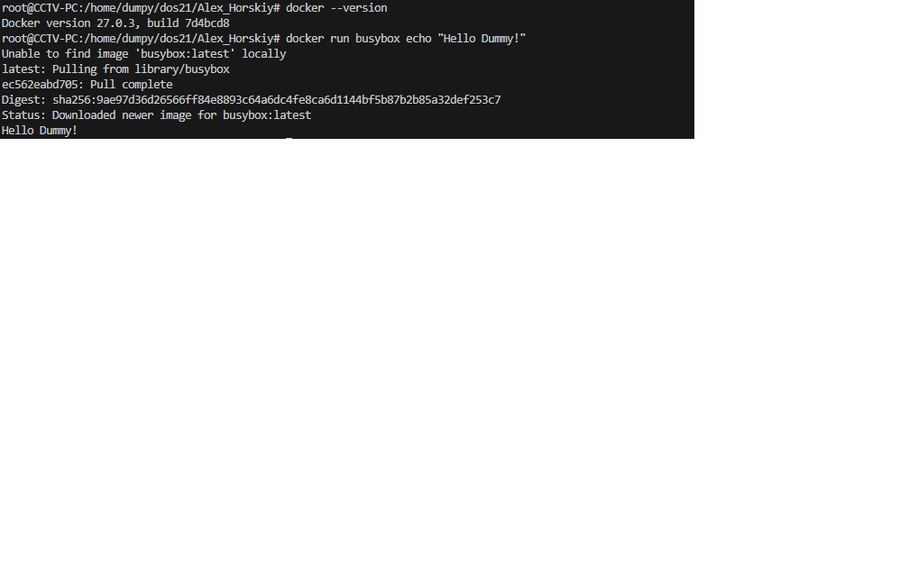

# Platform     - {WSL}
# Place        - {Work+Home}
# Mood         - {Gloomy}
# Undestanding - {20%}
# In the seat  - {6 hour}

1. Прочитать 2-ю главу Kubernetes in Action и повторить приведенные там примеры.
2. Познакомиться с Workload объектами Kubernetes (Pod, ReplicaSet, DaemonSet, Job, CronJob), а также их конфигурацией (Liveness Probe, Resources) путем запуска примеров из lecture45.

## Приступим

- Проверю установлен ли Docker. Если нет установлю, если да, то запускаю первый контейнер.
```bash
docker --version

doker run busybox echo "Hello Dummy!"
```


All OK
- Написал простейшее приложение app.js и Dockerfile для его запуска в контейнере.
```bash
FROM node:7
ADD app.js /app.js
ENTRYPOINT ["node", "app.js"]
```
```bash
const http = require('http');
const os = require('os');

console.log("Kubia server starting...");
var handler = function (request, response) {
    console.log("Received request from " + request.connection.remoteAddress);
    response.writeHead(200);
    response.end("You've hit " + os.hostname() + "\n");
};

var www = http.createServer(handler);
www.listen(8080);
```
- Создаем образ, запускаем, инспектируем и проверяем работу.
```bash
$ docker build -t kubia .
$ docker images
$ docker run --name kubia-container -p 8181:8080 -d kubia # порт 8080 занят Jenkins, использую 8181
$ docker inspect kubia-container
$ curl localhost:8080
Output -> You've hit 4f09a1b88265
```

Для понимания, что процессы внутри контейнера работают в хостовой ОС

```bash
$ docker exec -it kubia-container bash
$ ps aux # внутри контейнера
USER         PID %CPU %MEM    VSZ   RSS TTY      STAT START   TIME COMMAND
root           1  0.0  0.1 813608 25912 ?        Ssl  11:19   0:00 node app.js
root          12  0.2  0.0  20252  3284 pts/0    Ss   11:31   0:00 bash
root          18  0.0  0.0  17508  2092 pts/0    R+   11:31   0:00 ps aux

$ ps aux | grep app.js # на хостовой машине
root       16848  0.0  0.1 813608 25912 ?        Ssl  14:19   0:00 node app.js
root       20234  0.0  0.0   4032  2128 pts/0    S+   14:33   0:00 grep --color=auto app.js
```
All OK
- Остановил, удалил
```bash
$ docker stop kubia-container
$ docker rm kubia-container
```
- Забросил образ в docker.hub поменяв tag
```bash
$ docker tag kubia horskiy/kubia
$ docker push horskiy/kubia

```
- Теперь образ kubia можно запустить на любой машине
```bash
$ docker run -p 8080:8080 -d horskiy/kubia
```
- Поработаю с minicube
- minikube and kubectl были установлены ранее этими коммандами:
```bash
curl -LO https://storage.googleapis.com/minikube/releases/latest/minikube-linux-amd64
sudo install minikube-linux-amd64 /usr/local/bin/minikube

curl -LO "https://dl.k8s.io/release/$(curl -L -s https://dl.k8s.io/release/stable.txt)/bin/linux/amd64/kubectl"
sudo install -o root -g root -m 0755 kubectl /usr/local/bin/kubectl

```
C VirtualBox не заработало. WSL взрывается.
Буду пробовать работать с Docker driver

```bash
minikube start --driver=docker

```
На драйвере DOcker все заработало.

```bash
minikube start --driver=docker

kubectl get nodes
kubectl get pods -A

Output

devops@Handler:/mnt/d/Lern/dos21/Alex_Horskiy$ kubectl get nodes
NAME       STATUS   ROLES           AGE     VERSION
minikube   Ready    control-plane   3m42s   v1.30.0
devops@Handler:/mnt/d/Lern/dos21/Alex_Horskiy$ kubectl get pods -A
NAMESPACE     NAME                               READY   STATUS    RESTARTS   AGE
kube-system   coredns-7db6d8ff4d-4mm76           1/1     Running   0          3m35s
kube-system   coredns-7db6d8ff4d-bzlt6           1/1     Running   0          3m35s
kube-system   etcd-minikube                      1/1     Running   0          3m50s
kube-system   kube-apiserver-minikube            1/1     Running   0          3m49s
kube-system   kube-controller-manager-minikube   1/1     Running   0          3m49s
kube-system   kube-proxy-wdjww                   1/1     Running   0          3m35s
kube-system   kube-scheduler-minikube            1/1     Running   0          3m49s
kube-system   storage-provisioner                1/1     Running   0          3m47s

kubectl cluster-info

Kubernetes control plane is running at https://127.0.0.1:32771
CoreDNS is running at https://127.0.0.1:32771/api/v1/namespaces/kube-system/services/kube-dns:dns/proxy
```
- Step forward. Настройка K8s в GCP
gcloude install and runing

```bash
devops@Handler:/mnt/d/Lern/dos21/Alex_Horskiy$ gcloud --version
Google Cloud SDK 483.0.0
alpha 2024.06.28
beta 2024.06.28
bq 2.1.6
bundled-python3-unix 3.11.8
core 2024.06.28
gcloud-crc32c 1.0.0
gsutil 5.30
minikube 1.33.1
skaffold 2.11.1
```
- Создадим 2 узла в кластере
```bash
gcloud container clusters create kubia --num-nodes 2 --machine-type e2-micro

Output
Default change: VPC-native is the default mode during cluster creation for versions greater than 1.21.0-gke.1500. To create advanced routes based clusters, please pass the `--no-enable-ip-alias` flag
Note: The Kubelet readonly port (10255) is now deprecated. Please update your workloads to use the recommended alternatives. See https://cloud.google.com/kubernetes-engine/docs/how-to/disable-kubelet-readonly-port for ways to check usage and for migration instructions.
Note: Your Pod address range (`--cluster-ipv4-cidr`) can accommodate at most 1008 node(s).
Creating cluster kubia in us-central1-c... Cluster is being health-checked (master is healthy)...done.
Created [https://container.googleapis.com/v1/projects/my-project-dos21/zones/us-central1-c/clusters/kubia].
To inspect the contents of your cluster, go to: https://console.cloud.google.com/kubernetes/workload_/gcloud/us-central1-c/kubia?project=my-project-dos21
CRITICAL: ACTION REQUIRED: gke-gcloud-auth-plugin, which is needed for continued use of kubectl, was not found or is not executable. Install gke-gcloud-auth-plugin for use with kubectl by following https://cloud.google.com/kubernetes-engine/docs/how-to/cluster-access-for-kubectl#install_plugin
kubeconfig entry generated for kubia.
NAME   LOCATION       MASTER_VERSION      MASTER_IP     MACHINE_TYPE  NODE_VERSION        NUM_NODES  STATUS
kubia  us-central1-c  1.29.6-gke.1038001  23.236.58.25  e2-micro      1.29.6-gke.1038001  2          RUNNING
```
- Кластер создался, но с ошибкой. Не хватает плагина. Установим
```bash
https://cloud.google.com/sdk/docs/install-sdk#deb

```
- Посмотрим список узлов кластера.
```bash
kubectl get nodes

devops@Handler:/mnt/d/Lern/dos21/Alex_Horskiy$ kubectl get nodes
NAME                                   STATUS   ROLES    AGE   VERSION
gke-kubia-default-pool-3527cc6c-7jl8   Ready    <none>   32m   v1.29.6-gke.1038001
gke-kubia-default-pool-3527cc6c-jjfr   Ready    <none>   32m   v1.29.6-gke.1038001
```
- Можно получить дополнительные сведения 
```bash
kubectl describe node gke-kubia-85f6-node-0rrx

Выборочно
...
Capacity:
  cpu:                2
  ephemeral-storage:  98831908Ki
  hugepages-1Gi:      0
  hugepages-2Mi:      0
  memory:             993504Ki
  pods:               110

...
Namespace                   Name                                               CPU Requests  CPU Limits  Memory Requests  Memory Limits  Age      
  ---------                   ----                                               ------------  ----------  ---------------  -------------  ---      
  gke-managed-cim             kube-state-metrics-0                               105m (11%)    0 (0%)      130Mi (21%)      530Mi (86%)    37m      
  gmp-system                  gmp-operator-594b6bcdcd-bcw2j                      1m (0%)       0 (0%)      16M (2%)         2G (310%)      37m      
  kube-system                 fluentbit-gke-n22b9                                105m (11%)    0 (0%)      230Mi (37%)      530Mi (86%)    36m      
  kube-system                 gke-metrics-agent-qqfgr                            19m (2%)      0 (0%)      155Mi (25%)      155Mi (25%)    36m      
  kube-system                 kube-proxy-gke-kubia-default-pool-3527cc6c-7jl8    100m (10%)    0 (0%)      0 (0%)           0 (0%)         36m      
  kube-system                 metrics-server-v0.7.1-5564dbf674-224wm             5m (0%)       0 (0%)      50Mi (8%)        300Mi (48%)    37m      
  kube-system                 pdcsi-node-jwww4                                   10m (1%)      0 (0%)      20Mi (3%)        100Mi (16%)    36m      
Allocated resources:
  (Total limits may be over 100 percent, i.e., overcommitted.)
  Resource           Requests        Limits
  --------           --------        ------
  cpu                345m (36%)      0 (0%)
  memory             614665Ki (97%)  3606885Ki (573%)
  ephemeral-storage  0 (0%)          0 (0%)
  hugepages-1Gi      0 (0%)          0 (0%)
  hugepages-2Mi      0 (0%)          0 (0%)
```
Прикольно 

- Попробуем запустить приложение в K8s
```bash
kubectl run kubia --image=luksa/kubia --port=8080 --generator=run/v1
```
- Список подов
```bash
kubectl get pods

devops@Handler:/mnt/d/Lern/dos21/Alex_Horskiy$ kubectl get pods
NAME    READY   STATUS    RESTARTS   AGE
kubia   1/1     Running   0          51s
```
- Настроим доступ и масштабирование.
Created object Service 
```bash
kubectl expose rc kubia --type=LoadBalancer --name kubia-http

kubectl get services
devops@Handler:/mnt/d/Lern/dos21/Alex_Horskiy/HW_40$ kubectl get services
NAME         TYPE           CLUSTER-IP     EXTERNAL-IP     PORT(S)          AGE
kubernetes   ClusterIP      34.118.224.1   <none>          443/TCP          74m
kubia-http   LoadBalancer   34.118.239.0   34.30.159.244   8080:31787/TCP   115s


devops@Handler:/mnt/d/Lern/dos21/Alex_Horskiy/HW_40$ curl 34.30.159.244:8080
curl: (56) Recv failure: Connection reset by peer
```
Удаляем
```bash
kubectl delete pods --all                             # удаляем все поды
kubectl delete services --all                         # удаляем все сервисы
kubectl delete all --all                              # удаляем все ресурсы
kubectl delete pods,services,deployments -l app=kubia # удаляем ресурсы по меткам

```


```bash
kubectl exec -it dummy -- bash
kubectl logs dummy
kubectl describe pod dummy
kubectl create namespace coolspace
kubectl apply -f 2-namespace.yaml
kubectl get namespace
kubectl -n default get pod
kubectl -n kube-system get pod
kubectl get pod --all-namespaces
kubectl get pod -A
kubectl get pod -w
kubectl scale --replicas=4 rs/nicereplicaset
kubectl apply -f 3-replicaset.yaml # only declarative
kubectl apply -f 4-livenessprobes.yaml
kubectl apply -f 5-resources.yaml
kubectl apply -f 6-resourcequota.yaml
kubectl apply -f 7-daemonset.yaml
kubectl create job hello-world-job --image=centos:7 -- /bin/sh -c "echo Hello World"
kubectl apply -f 8-job.yaml`
kubectl create job hello-world-job --image=centos:7 --schedule="*/5 * * * *" -- /bin/sh -c "echo Hello World"
kubectl apply -f 9-cronjob.yaml

```
