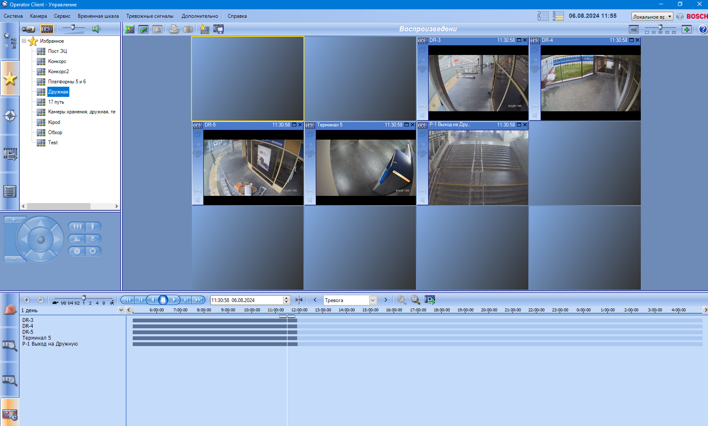
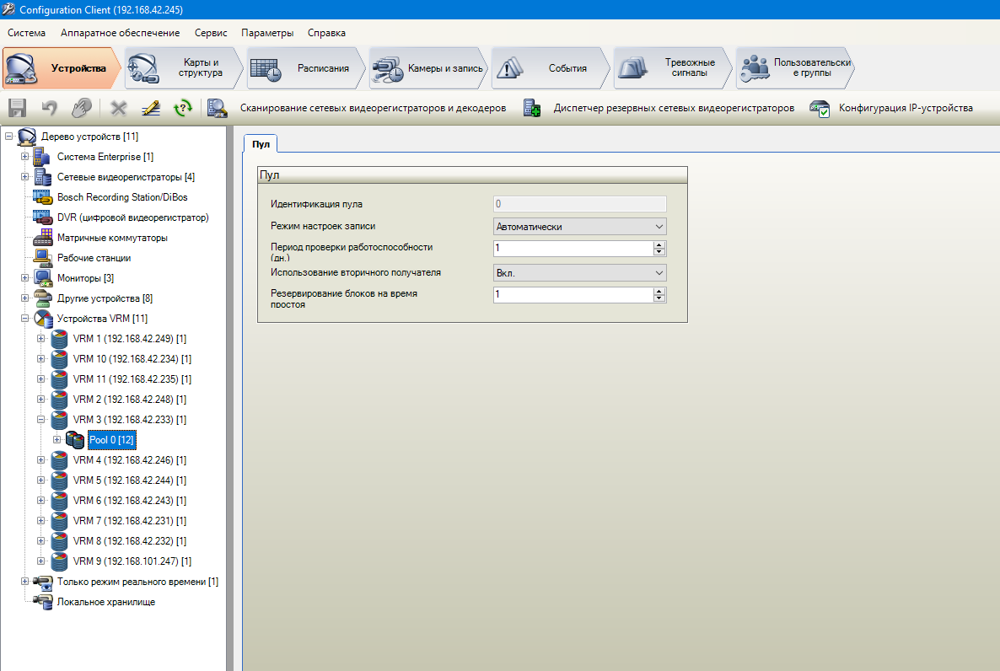
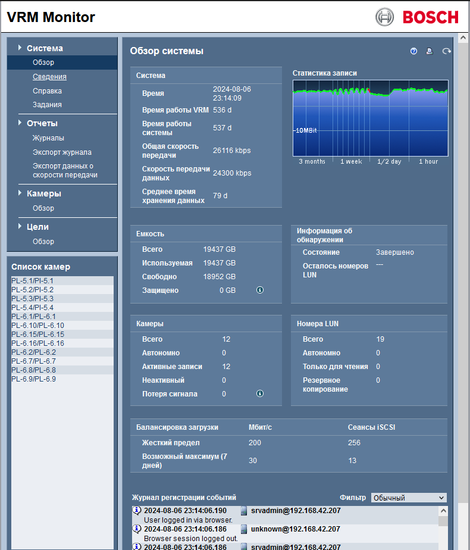
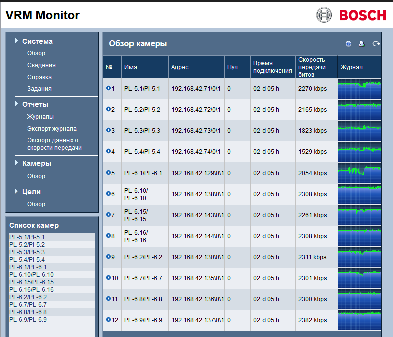
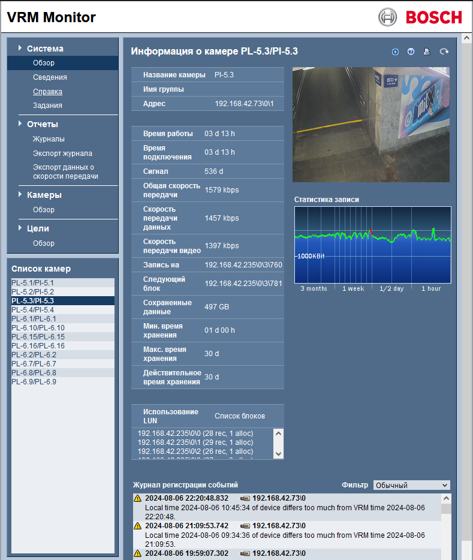
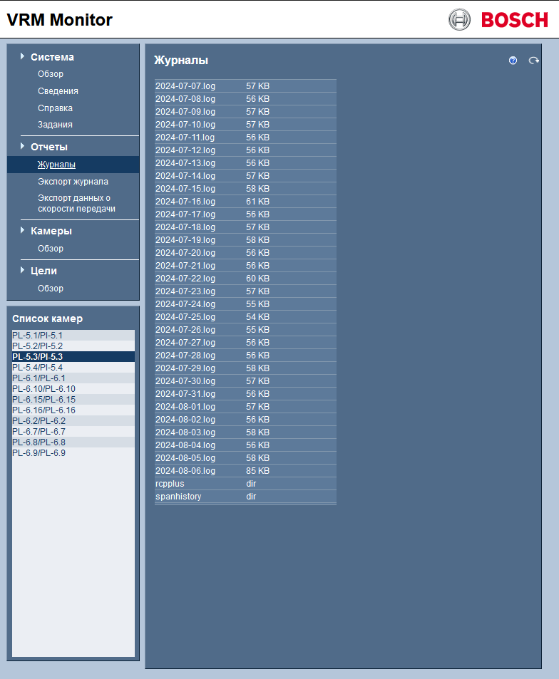
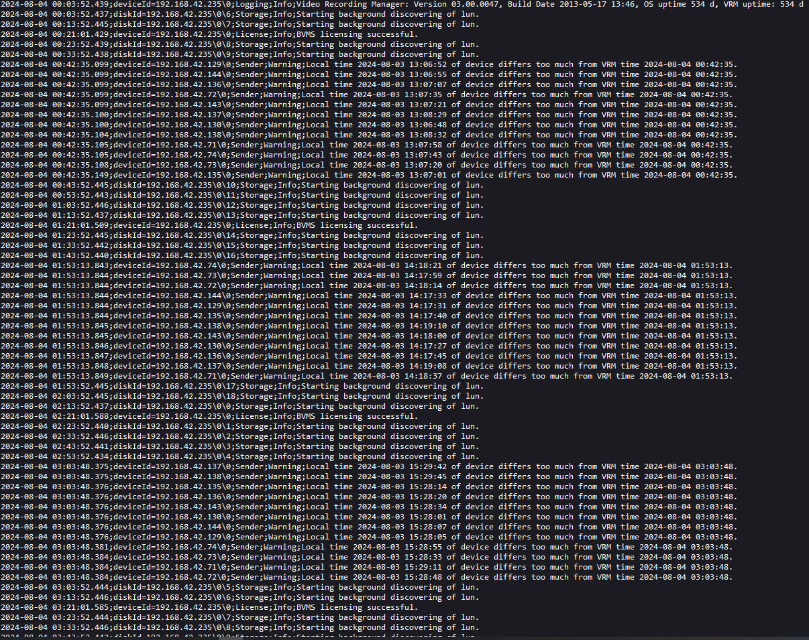
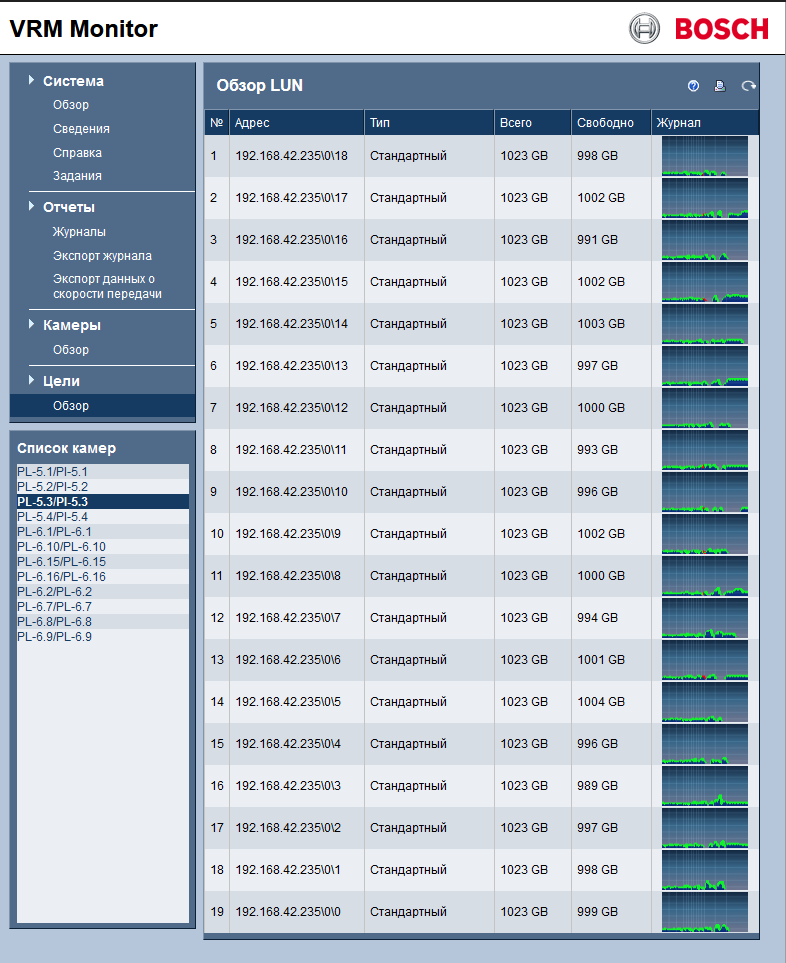
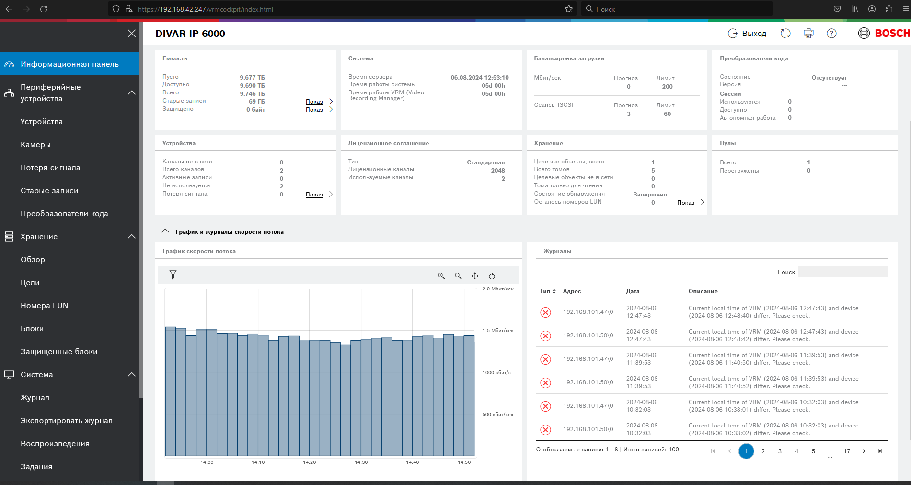

# Platform     - {WSL}
# Place        - {Work+Home}
# Mood         - {Sad}
# Undestanding - {5%}
# In the seat  - {1 hour}

Дедлайн: 19/08/2024

Установить Zabbix Server & Zabbix Agent на одну и ту же или несколько VM при помощи следующих Ansible ролей:
- geerlingguy.apache
- geerlingguy.php
- geerlingguy.mysql
- community.zabbix.zabbix_server
- community.zabbix.zabbix_web
- community.zabbix.zabbix_agent
- Использовать шаблоны Linux by Zabbix agent и Apache by HTTP

В случае проблем с локализацией установить пакет locales-all.

Проверить, что мониторинг работает, метрики собираются, графики рисуются 🤓

# Хочу немного рассказать про VRM Bosch 03.00.0043
# Одна из программ из комплекса CCTV Bosch
# В кратце состоит из управляющего сервера - установка, настройка, администрирование идет через него.

# Просмотр live и архива из клиентской программы, устанавливается на рабочих местах.

# Сервер файловые хранилки, на которые пишут камеры.
1. Устанавливается на файловый сервер. На сервере доступна по Localhost, удаленно по адресу сервера 192.168.42.244

2. Выводит сведения о камерах подключенных к данному серверу.

3. Дает live картинку и кучу параметров.

4. Собирает логи в журналы.

5. Так выглядят логи

6. Выводит сведения о LUN в которые пишут камеры.

7. А так выглядит свежая версия 04.31.0022, но не удобная, много информации, 
наглядно не видно идет запись на конкретной камере или нет. Мало наглядности, 
с первого взгляда проблему найти тяжело.

