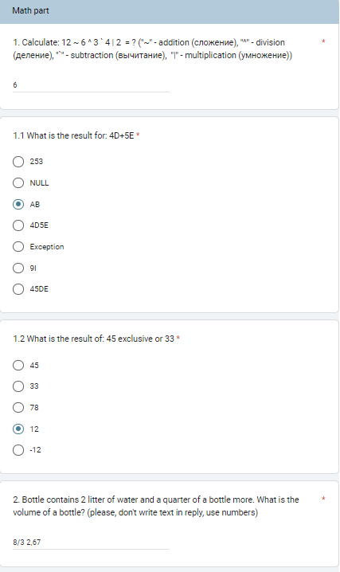
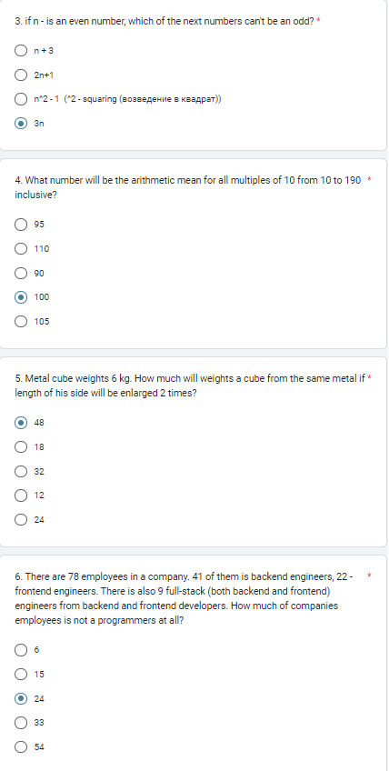
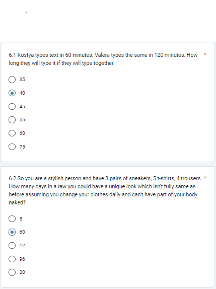
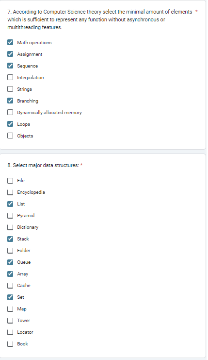
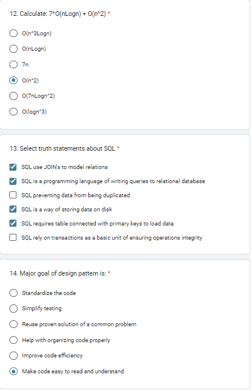
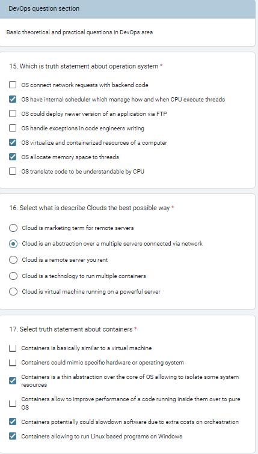
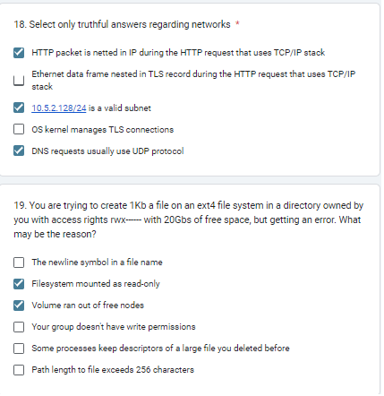

# Вопросы

20. Why OOP is a dominant approach in software engineering our days and what's core improvements it brings over to it's predecessors?

21. What is the core differences of an asynchronous programming over to multithreading programming?

22. Which problems commonly being solved by using synchronization primitives? Which is the most common synchronization primitive you know?

23. What are databases used for? Maybe it's better to store data simply in files on disk or even in computer memory?

24. Explain in your own words what happens in the database when some request for obtaining certain data according to some criteria arrives there. You can use the example of a wardrobe with clothes. How does this situation change, and does it change when there are indexes in the database?

25. How are CI/CD pipelines designed to improve the efficiency of software development? What are the main functions that should be assigned to them first?

26. ( IMPORTANT ) Please write a function (and write its code in the answer on any language) for this problem: The magical coin is a coin with a deviated probability of getting a tail. So you have N magical coins which are shuffled. On every coin, there is a probability of getting a tail, but it's on wizard's language and you can't read it, but it obviously influences coin's behavior. All magical coins is different, some of them deviate strongly and some of them behave similar to usual coins. There is also an old legend exists that tells: "If there is a big pile of magical coins, the 4th of the "most regular" coins from this pile could be a wonderful one". Write the function which will logically maximize your chances to find out the wonderful coin if you have no more than K tries for every coin. What is the complexity of your solution?

27. ( IMPORTANT !!! )  Describe in your own words what approach you would take in order to organize the automated deployment of a dotnet (or jvm) application on a remote server. Explain your chosen solutions. What problems might arise with the chosen approach? How can they be solved?

28. Do you have any experience with docker-compose, k8s, terraform, jenkins? If so, please tell us a little about what you did and why.

